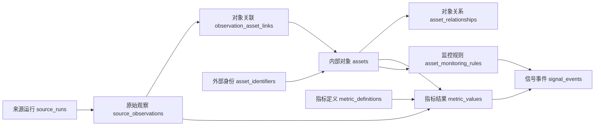

# 加密信号平台：资产身份与指标数据模型

## 目标与边界

平台要回答三个不同的问题：**这是谁**（资产身份）、**观察到了什么**（来源事实）、**由此计算出什么**（指标和信号）。本方案保留原先的四张 Asset 权威表，再补齐使爬虫、计算和前端能够实际衔接的八张表，共十二张逻辑表。逻辑表不意味着初期必须部署十二个服务；最初可以都放在同一个数据库。

当前 SignalStudio 的 `nodes`、`node_fields`、`edges`、`edge_field_usages` 是**数据处理设计图**，描述字段与步骤的依赖；下面的表存放**业务对象及运行结果**。两种图应分开，通过指标键、规则键和处理节点 ID 建立引用。

设计图的节点库按**数据来源、处理步骤、业务表、产出**分组。`assets`、`asset_identifiers`、`asset_relationships`、`asset_monitoring_rules` 各自是一个固定、可连线的表节点，表示未来程序要访问的确切业务表；图节点不表示表中的每一行。表节点连向处理步骤表示读表，审核步骤连向表节点表示规划中的写表，连接详情记录查询键、条件或写入约定。这些连接目前只是程序接入契约，并不执行 SQL。每个处理节点可以归到信号线、资产认知线或两条线共用；总览和两条线是同一张持久化设计图的筛选视图。“资产识别／绑定”先查询 `asset_identifiers` 找外部标识对应的候选 `asset_id`，再从 `assets` 核对内部身份；按资产聚合前必须先绑定，来源或市场粒度的结果也可计算后再绑定。信号产生后或前端展示前，“关联资产查询”读取已审核的 `asset_relationships` 和相关 `assets`；有关联并不等于另一个资产也产生了信号。“关系发现”提出待审核的关系，“身份与关系审核”记录审核步骤，“规则判断”读取 `asset_monitoring_rules` 的适用版本。当前应用只保存设计，尚未部署这些业务表、运行查询、匹配、关系审核或规则引擎，也没有真实业务记录。设计图是无环依赖图；认知更新后的反馈要在后续运行中读取版本化资产状态，不能画成同一次计算中的循环边。

## 十二张表及每行含义

| 层 | 表 | 一行代表什么 | 必要字段或约束 |
|---|---|---|---|
| 身份 | `assets` | 一个系统内可监控的对象 | `asset_id` 主键、`canonical_key`、`display_name`、`asset_type`、`identity_status`、`tradability_status`、时间戳 |
| 身份 | `asset_identifiers` | 某来源对一个对象的一个身份声明 | `identifier_id`、`asset_id`、`namespace`、`identifier_type`、`external_id`、`context`、`status`、证据、有效期 |
| 身份 | `asset_relationships` | 两个内部对象之间一条有方向的关系 | `from_asset_id`、`relationship_type`、`to_asset_id`、证据、置信度、有效期 |
| 规则 | `asset_monitoring_rules` | 某作用范围内某规则的一个不可变版本 | `rule_key`、`version`、`scope_type`、`scope_id`、条件、要求的证据、状态、有效期 |
| 采集 | `source_runs` | 某来源一次抓取或一个消费批次 | `run_id`、来源、查询范围、开始/结束时间、成功状态、覆盖范围、记录数、连接器版本 |
| 采集 | `source_observations` | 来源提供的一条原始事实或快照 | `observation_id`、`run_id`、来源记录 ID、事件时间、采集时间、原始内容引用、内容哈希 |
| 关联 | `observation_asset_links` | 一条观察与一个资产的一种关联 | `observation_id`、`asset_id`、角色、匹配方法、置信度、匹配版本、状态 |
| 审核 | `identity_review_cases` | 一次待定匹配、冲突、合并或拆分的处理过程 | 输入身份、候选资产、证据、状态、决定、处理人/程序、时间 |
| 行情 | `market_instruments` | 某场所的一个交易标的，例如 BTC/USDT 现货 | `venue`、`external_market_id`、`instrument_type`、`base_asset_id`、`quote_asset_id`、有效期 |
| 计算 | `metric_definitions` | 某指标的一个不可变计算版本 | `metric_key`、`version`、对象粒度、输入、窗口、单位、公式/算法、缺失值策略 |
| 计算 | `metric_values` | 一个对象在一个时间窗口的一个指标计算结果 | 对象 ID、指标键/版本、窗口起止、数值、单位、质量状态、计算时间、输入证据 |
| 输出 | `signal_events` | 某对象在某窗口按某规则版本的一次触发、更新或撤回 | 对象 ID、规则键/版本、窗口、状态、等级、解释、指标和原始证据引用 |

## 四张 Asset 权威表如何定义

### 1. `assets`：内部对象

- `asset_id` 用 UUID/ULID 等**无语义、永久不变**的 ID。`crypto:BTC` 这样的字符串可以作为 `canonical_key`，不应作为数据库主键：符号重名、改名或资产拆分时，它会失去稳定性。
- `asset_type` 表示项目、加密资产、链上部署、公司、人物、社交账号、智能合约、叙事、法币等。`identity_status` 表示 `candidate / verified / merged / rejected / deprecated`；它与 `tradability_status` 独立。
- 项目、代币、链上合约、官方账号和交易市场不是同一个东西。比如 Ethereum 项目、ETH、某部署合约、官方 X 账号需要分别建模，再用关系连接。交易市场另放 `market_instruments`。
- 被合并的旧 `asset_id` 保留为重定向记录，不硬删；合并后重算受影响指标和信号。拆分必须生成审核记录。

对象粒度要先定清楚，不能因为名称相近就压成一行：

| 遇到的对象 | 建模方式 | 原因 |
|---|---|---|
| Ethereum 项目与 ETH | 两个 `assets`，用 `token_of_project` 连接 | 项目新闻和代币行情并非同一事实 |
| ETH 与 WETH | 两个 `assets`，用 `wrapped_representation_of` 连接 | 包装、赎回及合约风险不同 |
| 同名的两个代币 | 两个 `assets`，各自保留来源 ID 与链/合约信息 | Symbol 与名称不能证明同一身份 |
| Bitcoin 与 BTC/USDT 现货 | BTC 是 `assets`；交易对是 `market_instruments` | 一个交易对同时涉及基础资产与报价资产 |
| 官方 X 账号与所属项目 | 两个 `assets`，用 `official_account_of` 连接 | 账号可能更名、失效或被接管 |
| “AI Agent” 叙事与其中的代币 | 叙事和各代币分别建 `assets`，用成员关系连接 | 叙事热度不自动等于每个代币的价格信号 |

### 2. `asset_identifiers`：外部身份

- 外部 ID 必须连同 `namespace`、`identifier_type` 和必要的 `context` 判断。链上地址的上下文至少包含链；交易所代码的上下文包含场所和产品类型。
- `provider_id`、链 ID 加合约地址属于较强线索；名称、符号、文本别名属于较弱线索。弱线索可以同时指向多个候选对象，不能凭 `BTC` 或同名自动确认合并。
- 已确认且仍有效的**强标识**应有唯一约束，例如 `(namespace, identifier_type, normalized_external_id, context)` 同一有效时间内最多对应一个资产。名称/符号别名不能套这个唯一约束。
- 保留 `raw_external_id`、规范化后的 ID、首次/末次出现时间、有效期、证据和匹配决策版本。外部名称变化时关闭旧声明、增加新声明，历史记录仍可按当时版本重放。

### 3. `asset_relationships`：业务关系

- 用 `from_asset_id -> relationship_type -> to_asset_id` 明确方向；没有必要再存一个容易与方向冲突的 `direction` 字段。
- 常用关系包括 `token_of_project`、`official_account_of`、`deployed_on`、`wrapped_representation_of`、`member_of_narrative` 和 `associated_with`。`related_to` 只能作人工探索线索，不自动传播评分。
- 包装币、跨链桥币和原生币通常应保留独立身份，再用关系连接，因为合约、赎回和市场风险可能不同。是否在某个产品视图汇总，由指标定义决定。
- 每条关系记录证据、来源、有效期与审核状态。人物新闻关联某项目，不等于直接给其代币产生交易信号。

### 4. `asset_monitoring_rules`：监控与触发

- `scope_type` 取 `global / asset_type / asset`；`scope_id` 在全局为空，在类型和资产范围中填写相应 ID。单资产覆盖类型，类型覆盖全局；同一规则键在同一范围的有效期不能重叠。
- `rule_key` 表示长期不变的规则身份；`version` 标识不可变配置。修改阈值产生新版本，旧版本仍能解释历史信号。
- 规则引用明确的 `metric_key + metric_version` 或兼容范围，列出条件、最低数据覆盖率、冷却时间、去重窗口、证据要求和缺失值处理。不要把任意未审查 SQL/代码当成可执行规则配置。
- `stablecoin` 等细分类别可以先作为资产类型或受控分类；若一个资产需要多个标签且标签会随时间变化，再加 `asset_classifications`，不要把类别全塞进自由文本 `metadata`。

## 为什么增加八张表

### 采集事实与“没有数据”的区别

`source_runs` 保存一次抓取的时间、范围、状态和覆盖率。`source_observations` 保存这次抓到的事实及原文引用。这两张表让系统区分“过去 30 天确实没有讨论”和“爬虫过去 30 天没运行”。计算沉寂后升温时，如果覆盖不够，应显示“数据不足”，不能显示“零讨论”。

原始记录写入要幂等：优先使用来源提供的稳定记录 ID 和修订号；来源没有稳定 ID 时，用来源、查询范围、事件时间和内容哈希构造幂等键。保留 `event_at`（事实发生时间）和 `ingested_at`（系统收到时间），避免晚到数据造成回测穿越。

一条新闻可以提及多个项目，故通过 `observation_asset_links` 关联多个 `asset_id`，并写明 `subject / mention / author / source_account` 等角色。价格快照通常有一个主对象，但仍可使用相同关联机制。引用映射版本，身份修正后可以定位受影响的观察。

`identity_review_cases` 是冲突工作台：记录“这个外部标识可能是 A 或 B”的候选、证据和最终决定。审核结果再写入已确认的 `asset_identifiers`；未确认数据仍保留原始观察，不静默丢弃。

### 市场与资产不是同一层

`BTCUSDT` 或 `BINANCE:BTCUSDT` 是**交易市场标识**，它有基础资产 BTC、报价资产 USDT、交易场所和产品类型。它不应直接写成 BTC 的别名。现货、永续、不同交易所的同名交易对也要区分。行情指标可以先存交易市场粒度，再按明确的聚合规则得到 BTC 的跨市场指标。[Binance 官方术语说明](https://developers.binance.com/en/docs/products/spot/faqs/spot_glossary)也将 `BTCUSDT` 的 BTC 与 USDT 分别定义为基础资产和报价资产。

### 指标、数值和信号

`metric_definitions` 管“怎么算”：例如 `social_mentions_24h` 的去重规则、时间窗口、计数单位；`volume_to_market_cap_24h` 的分子分母来源和币种；`heat_acceleration` 的基线窗口与缺失策略。

`metric_values` 管“算出了多少”：记录资产或交易市场、指标版本、窗口、数值、单位、质量状态和输入证据。原始价格与计算后的分数都可以进入指标层，但要通过定义和来源标注区分。数值修订采用新计算版本或修订号，不覆盖先前结果。

`signal_events` 管“为什么入榜”：记录触发规则版本、参与指标、阈值、证据、解释和状态。对重复触发用 `(asset_id, rule_key, window)` 等业务键去重；晚到数据改变结论时产生更新或撤回事件，保留历史。

## 两个具体流程

### A. 新币出现

1. 采集 CoinGecko 新上架列表，记录 `source_runs` 与逐币 `source_observations`。它的 `activated_at` 是 **CoinGecko 激活时间**，并不等于代币部署时间或交易所首次上市时间。[CoinGecko 新上架接口说明](https://docs.coingecko.com/reference/coins-list-new)
2. 用 CoinGecko 的 coin ID 查 `asset_identifiers`。没有映射时，再查链 ID + 合约地址等强证据；符号仅用于候选搜索。CoinGecko 的币种列表明确将 coin ID、symbol、name、platform/contract 分开提供。[CoinGecko 币种列表说明](https://docs.coingecko.com/reference/coins-list)
3. 证据足够且无冲突时创建 `assets` 并确认标识；否则开 `identity_review_cases`。创建 `observation_asset_links` 后，依据观察时间确定 `first_seen_by_source`，再计算新上架状态等指标。
4. 监控规则判断是否形成信号；前端“新项目”表显示内部对象、来源、首次发现/激活时间、身份状态、价格等，并能点开原始证据。

### B. 沉寂后升温

1. 根据 `source_runs` 检查过去 30 天的数据覆盖。覆盖不足，结果标记 `insufficient_coverage`。
2. 将社交/新闻观察通过 `observation_asset_links` 归到内部资产，做内容去重和独立作者计数。
3. 计算 `mentions_30d`、`mentions_24h`、`unique_authors_24h`、价格和成交量变化，所有结果带窗口及指标版本。
4. 规则比较长期基线与当前热度，并按证据要求判断是否触发；`signal_events` 保留触发原因。前端“突然升温”表每行是一个资产在一个触发窗口的结果，可追到计算和原始观察。

## 最小实施顺序

1. **身份闭环**：先建 `assets`、`asset_identifiers`、`identity_review_cases`；接入一个结构化来源。实现候选、确认、冲突、合并、拆分和历史追溯。
2. **观察闭环**：加入 `source_runs`、`source_observations`、`observation_asset_links`；保证幂等、事件时间、覆盖状态和原始证据。
3. **首个输出表**：加入 `metric_definitions`、`metric_values`、`asset_monitoring_rules`、`signal_events`，先完成“新项目”或“突然升温”中的一个；从前端列反推所需指标。
4. **扩展关系和市场**：在接入新闻传播和交易所报价时加入 `asset_relationships`、`market_instruments`；不要在尚未使用时预先填大量猜测关系。

本方案是目标逻辑模型，**当前项目尚未实现这些业务表、爬虫或计算任务**。实现前先定第一个输出表的行粒度、字段、刷新频率和数据来源，再把这十二张逻辑表分阶段落地。
